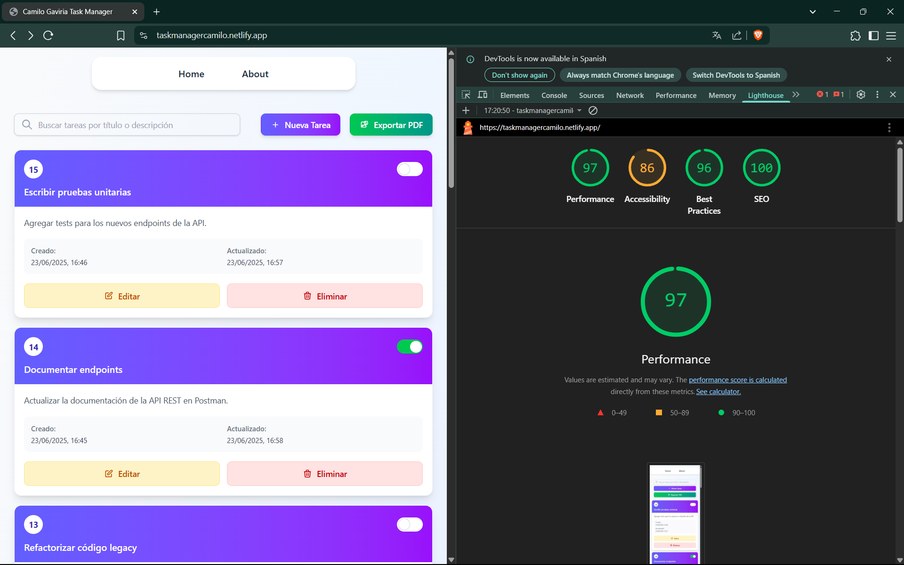
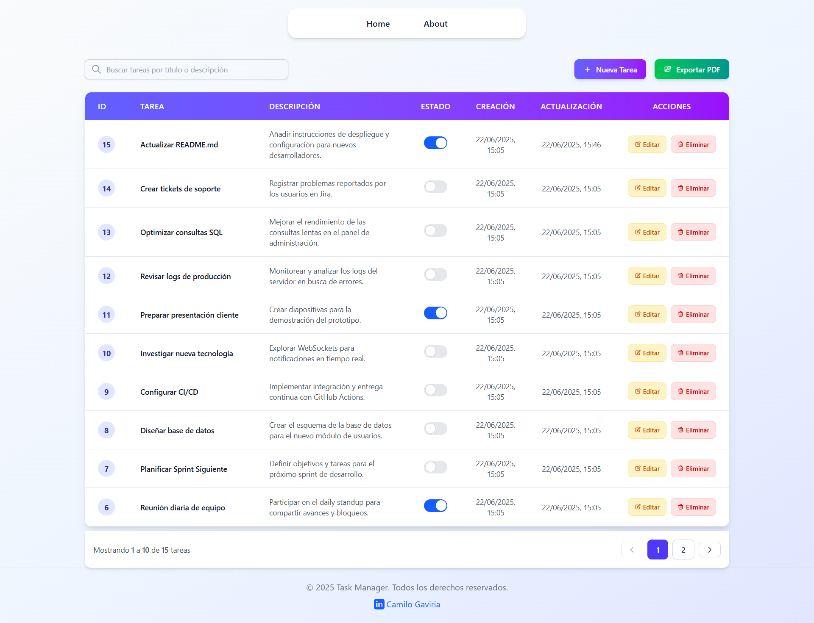
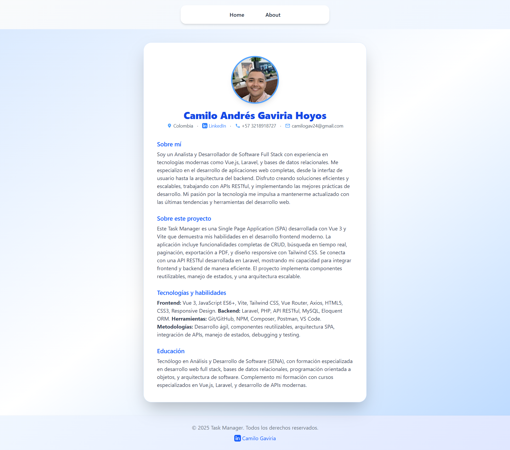
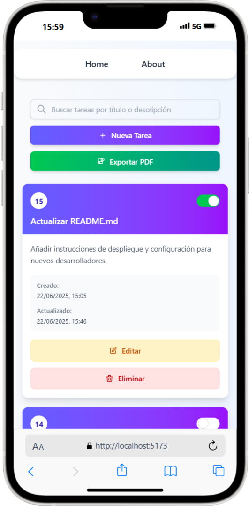
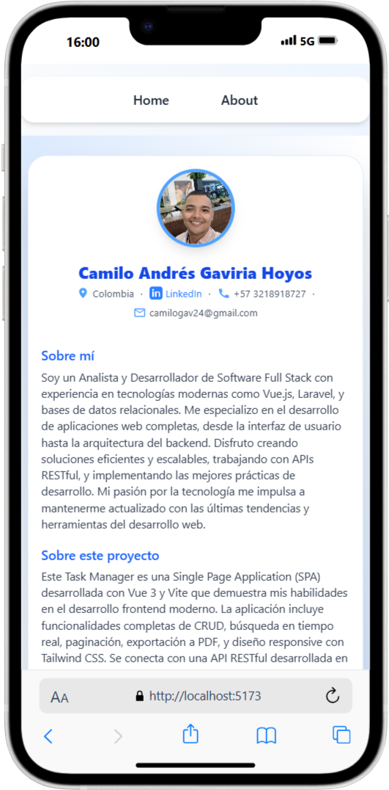

# 🎨 Task Manager Frontend (Vue 3 + Vite)

Este repositorio contiene la aplicación frontend de gestión de tareas, construida con Vue 3 y Vite para una experiencia de usuario rápida y reactiva. Consume una API RESTful desarrollada en Laravel. Demo: https://taskmanagercamilo.netlify.app/

## 🚀 Características

- **SPA (Single Page Application)**: Experiencia de usuario fluida sin recargas de página completas.
- **Interfaz Reactiva**: Los cambios en los datos se reflejan instantáneamente en la UI.
- **CRUD Completo**: Permite a los usuarios crear, visualizar, actualizar (marcar como completado) y eliminar tareas.
- **Diseño Responsivo**: Se adapta a diferentes tamaños de pantalla (escritorio, tabletas, móviles) gracias a Tailwind CSS.
- **Componentes Reutilizables**: Estructura modular basada en componentes Vue.
- **Manejo de Rutas**: Navegación entre vistas (Home, About) con Vue Router.
- **Manejo de Estados y Errores**: Feedback visual al usuario (mensajes Toast) para operaciones y posibles fallos.
- **Búsqueda Dinámica**: Filtra tareas por título o descripción en tiempo real.
- **Paginación**: Navega eficientemente por grandes volúmenes de tareas.
- **Exportación a PDF**: Permite al usuario descargar un listado de tareas en formato PDF, generado desde el backend.

## 🛠 Tecnologías Utilizadas

- **Vue 3** (Vue 3.2.11)
- **Vite** (Vite 4.3.9)
- **Axios** (Axios 1.1.3): Cliente HTTP para interactuar con la API REST del backend.
- **Tailwind CSS** (Tailwind CSS 3.2.4): Framework CSS para un desarrollo de UI rápido y personalizable.
- **JavaScript ES6+**
- **Vue Router** (Vue Router 4.1.6): Para la gestión de rutas y vistas.

## 📋 Requisitos del Sistema

- Node.js >= 22.x
- NPM (viene con Node.js)
- Git

## 🚀 Instalación y Configuración

Sigue estos pasos para poner en marcha el frontend en tu entorno local:

### 1. Clonar el repositorio:

```bash
git clone https://github.com/GaviriaCamilo/task-manager-frontend.git
cd task-manager-frontend
```

### 2. Instalar dependencias de NPM:

```bash
npm install
```

### 3. Configurar el archivo de entorno:

Copia el archivo de ejemplo `.env.example` a `.env`:

```bash
cp .env.example .env
```

### 4. Configurar la URL de la API en .env:

Abre el archivo `.env` y asegúrate de que la variable `VITE_API_URL` apunte a la dirección donde se está ejecutando tu backend de Laravel (por defecto, `http://localhost:8000/api`):

```env
VITE_API_URL=http://localhost:8000/api
```

### 5. Iniciar el servidor de desarrollo de Vite:

```bash
npm run dev
```

El frontend estará disponible en `http://localhost:5173`.

## 🎨 Capturas de Pantalla

Aquí puedes ver algunas capturas de pantalla de la aplicación en funcionamiento:

### Vista de Escritorio (Desktop)

* **Página Principal (lighthouse Report):**
    

* **Página Principal (Listado de Tareas):**
    

* **Página "About":**
    

### Vista Móvil (Mobile)

* **Página Principal (Listado de Tareas en móvil):**
    

* **Página "About" (en móvil):**
    


> **Importante**: Asegúrate de que el backend esté funcionando antes de intentar acceder al frontend, ya que este último depende completamente de la API para obtener y gestionar las tareas.

## 📁 Estructura del Proyecto

```
task-manager-frontend/
├── public/                          # Archivos públicos que se sirven directamente (ej. index.html, favicon).
├── src/
│   ├── assets/                      # Archivos estáticos como imágenes y CSS global.
│   │   ├── img/                     # Contiene imágenes utilizadas en la aplicación.
│   │   └── vue.svg                  # Icono SVG de Vue.
│   ├── components/                  # Componentes Vue reutilizables para construir la UI.
│   │   ├── layout/                  # Componentes estructurales de la aplicación (Header, Footer).
│   │   │   ├── Footer.vue
│   │   │   └── Header.vue
│   │   ├── tasks/                   # Componentes específicos relacionados con la visualización y gestión de tareas.
│   │   │   ├── ExpandableText.vue   # Componente para mostrar descripciones largas de tareas con opción de expandir/colapsar.
│   │   │   ├── ModalDeleteTask.vue  # Modal de confirmación para la eliminación de tareas.
│   │   │   ├── ModalTask.vue        # Modal de formulario para crear y editar tareas.
│   │   │   ├── PaginationControls.vue # Controles de interfaz para la paginación de la lista de tareas.
│   │   │   └── TaskTable.vue        # Tabla y diseño responsivo para mostrar el listado de tareas.
│   ├── pages/                       # Vistas principales de la aplicación, que utilizan los componentes para formar las pantallas completas.
│   │   ├── HomePage.vue             # Vista principal que muestra el listado de tareas, búsqueda, paginación y opciones de CRUD.
│   │   └── AboutPage.vue            # Vista "Acerca de" la aplicación.
│   ├── router/                      # Configuración de Vue Router para definir las rutas de la aplicación.
│   │   └── index.js                 # Define las rutas y mapea componentes a URL específicas.
│   ├── services/
│   │   └── taskService.js           # Módulo que encapsula las llamadas a la API del backend utilizando Axios. Gestiona la URL base de la API.
│   ├── App.vue                      # Componente raíz de la aplicación Vue.
│   └── main.js                      # Punto de entrada principal de la aplicación, inicializa Vue y el router.
├── .env                             # Archivo de configuración de entorno para variables de Vite.
├── .gitignore
├── index.html                       # Plantilla HTML principal de la SPA.
├── package.json                     # Define las dependencias del proyecto y los scripts de NPM.
├── package-lock.json                # Bloquea las versiones exactas de las dependencias.
└── vite.config.js                   # Configuración de Vite para el proceso de build y desarrollo.
```

## ⚠ Solución de Problemas

### Error: "Failed to fetch" o problemas de CORS

**Causa**: El frontend no puede comunicarse con el backend. Esto suele deberse a que el backend no está corriendo, o hay un problema con la configuración de CORS.

**Solución**:

1. Asegúrate de que tu backend de Laravel esté ejecutándose en `http://localhost:8000` (`php artisan serve`).

2. Verifica que la variable `VITE_API_URL` en tu archivo `.env` del frontend sea correcta (`VITE_API_URL=http://localhost:8000/api`).

3. Asegúrate de que la configuración de CORS en tu backend (`config/cors.php`) incluya `http://localhost:5173` en la lista `allowed_origins`. Después de cualquier cambio en el backend, limpia la caché de configuración (`php artisan config:clear`) y reinicia el servidor.

### Errores de NPM ("command not found", "cannot find module")

**Causa**: Las dependencias de Node.js no están instaladas correctamente o Node.js/NPM no están en tu PATH.

**Solución**:

1. Asegúrate de tener Node.js y NPM instalados. Puedes verificarlos con:

```bash
node --version
npm --version
```

2. Si las versiones son correctas, intenta reinstalar las dependencias de NPM:

```bash
npm install
```

3. Si persiste, borra la carpeta `node_modules` y el archivo `package-lock.json` y vuelve a ejecutar `npm install`.

## 🔮 Testing

Puedes ejecutar los tests del frontend con:

```bash
npm run test
```

## 📦 Build para Producción

Para generar una versión optimizada del frontend para producción (archivos estáticos para ser servidos por un servidor web):

```bash
npm run build
```

Esto creará una carpeta `dist/` en la raíz de tu proyecto frontend con los archivos listos para desplegar.

## 📄 Licencia

Este proyecto está bajo la Licencia MIT - consulta el archivo LICENSE para más detalles.

## 👤 Autor

**Camilo Gaviria**
- GitHub: [GaviriaCamilo](https://github.com/GaviriaCamilo)
- Email: camilogav24@gmail.com

## 🔗 Enlaces

- **Repositorio del Backend**: [Enlace al repositorio del backend] (Añadir el enlace una vez creado)
- **Repositorio**: https://github.com/GaviriaCamilo/task-manager-frontend
- **Demo en vivo**: https://taskmanagercamilo.netlify.app/
